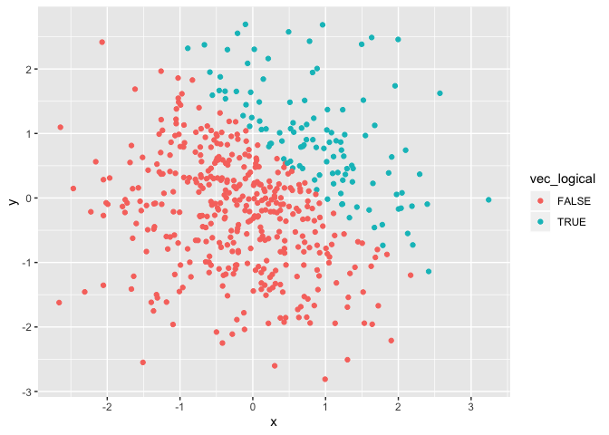
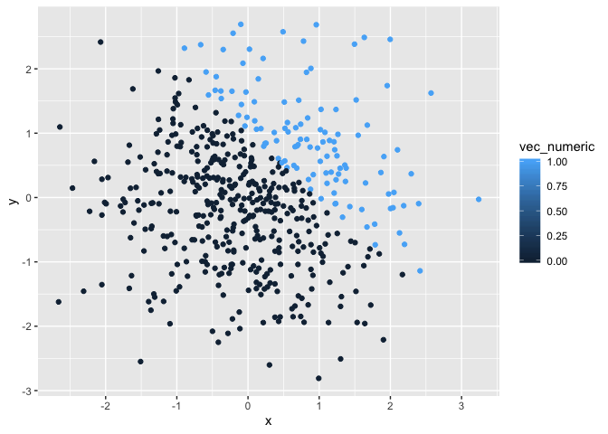

p8105\_hw1\_rw2708
================
Ran Wang
9/13/2019

# Problem 1

The chunk below creates a dataframe containing a sample of size 8 from a
random normal variable, a logical vector indicating whether elements of
the sample are greater than 0, a character vector of length 8, and a
factor vector of length 8, with 3 different factor “levels”. Besides, I
also computed the mean of each variable in this dataframe.

``` r
hw1_df = tibble(
  norm_samp = rnorm(8,0,1),
  vec_logical = norm_samp > 0,
  vec_char = c("1","2","3","4","5","6","7","8"),
  vec_factor = factor(c("high","medium","low","high","medium","low","high","medium"))
)

hw1_df
## # A tibble: 8 x 4
##   norm_samp vec_logical vec_char vec_factor
##       <dbl> <lgl>       <chr>    <fct>     
## 1   -0.560  FALSE       1        high      
## 2   -0.230  FALSE       2        medium    
## 3    1.56   TRUE        3        low       
## 4    0.0705 TRUE        4        high      
## 5    0.129  TRUE        5        medium    
## 6    1.72   TRUE        6        low       
## 7    0.461  TRUE        7        high      
## 8   -1.27   FALSE       8        medium

mean_norm = mean(pull(hw1_df, norm_samp))
mean_norm
## [1] 0.2348464

mean_logical = mean(pull(hw1_df, vec_logical))
mean_logical
## [1] 0.625

mean_char = mean(pull(hw1_df, vec_char))
## Warning in mean.default(pull(hw1_df, vec_char)): argument is not numeric or
## logical: returning NA
mean_char 
## [1] NA

mean_factor = mean(pull(hw1_df, vec_factor))
## Warning in mean.default(pull(hw1_df, vec_factor)): argument is not numeric
## or logical: returning NA
mean_factor 
## [1] NA
```

Findings: We can get the mean of numerical and logical variables, but we
can not compute the mean for character and factor variables.

Here is a code chunk that applies the as.numeric function to the
logical, character, and factor variables.

``` r
as.numeric(pull(hw1_df, vec_logical))
as.numeric(pull(hw1_df, vec_char))
as.numeric(pull(hw1_df, vec_factor))
```

Explanation for the above code chunk: logical variables, character
variables, and factor variables are all coerced to numeric ones. Reason:
the as.numeric function serves to convert these variables to numeric
form. This explains what happened when I try to get the mean, since it
is only reasonable to compute the mean of numeric variables, instead of
the character and factor variables. After the conversion, I can
calculate the mean of all of them.

The second code chunk is associated with the conversion of logical
vectors.

``` r
numeric_convert <- as.numeric(pull(hw1_df, vec_logical))
numeric_multiply = numeric_convert * pull(hw1_df,norm_samp)
numeric_multiply
## [1] 0.00000000 0.00000000 1.55870831 0.07050839 0.12928774 1.71506499
## [7] 0.46091621 0.00000000

factor_convert <- as.factor(pull(hw1_df, vec_logical))
factor_multiply = factor_convert * pull(hw1_df,norm_samp)
factor_multiply   #factor cannot be multiplied by numerical variables
## [1] NA NA NA NA NA NA NA NA


factor_convert <- as.factor(pull(hw1_df, vec_logical))
factor_numeric <- as.numeric(factor_convert)
factor_numeric_multiply = factor_numeric * pull(hw1_df,norm_samp)
factor_numeric_multiply 
## [1] -0.5604756 -0.2301775  3.1174166  0.1410168  0.2585755  3.4301300
## [7]  0.9218324 -1.2650612
```

# Problem 2

\*First I create a dataframe containing variables for my plots.

``` r
hw1_problem2_df = tibble(
  x = rnorm(500,0,1),
  y = rnorm(500,0,1),
 vec_logical = (x + y) > 1,
 vec_numeric = as.numeric(vec_logical),
 vec_factor = as.factor(vec_logical)
 )

hw1_problem2_df
## # A tibble: 500 x 5
##         x       y vec_logical vec_numeric vec_factor
##     <dbl>   <dbl> <lgl>             <dbl> <fct>     
##  1 -0.687  0.150  FALSE                 0 FALSE     
##  2 -0.446 -0.0792 FALSE                 0 FALSE     
##  3  1.22  -0.0974 TRUE                  1 TRUE      
##  4  0.360  0.216  FALSE                 0 FALSE     
##  5  0.401  0.882  TRUE                  1 TRUE      
##  6  0.111  0.206  FALSE                 0 FALSE     
##  7 -0.556 -0.616  FALSE                 0 FALSE     
##  8  1.79  -0.735  TRUE                  1 TRUE      
##  9  0.498 -0.132  FALSE                 0 FALSE     
## 10 -1.97   0.310  FALSE                 0 FALSE     
## # … with 490 more rows
```

Here is a short descriptive of my vector.

  - The dataset has 500 rows and 5 columns.

  - The mean of x is 0.0220554

  - The median of x is 0.0092096

  - The standard deviation of x is 0.9759859

  - The proportion of cases for which x + y \> 1 is 0.226

The first is a scatterplot of `y` vs `x` (color points using logical
variables).

``` r
ggplot(hw1_problem2_df, aes(x = x, y = y,color = vec_logical)) + geom_point()
```

<!-- -->

``` r
ggsave("scatter_plot.pdf", height = 4, width = 6)
```

The second is a scatterplot of `y` vs `x` (color points using numeric
variables).

``` r
ggplot(hw1_problem2_df, aes(x = x, y = y,color = vec_numeric)) + geom_point()
```

<!-- -->

The third scatterplot of `y` vs `x` (color points using the factor
variables).

``` r
ggplot(hw1_problem2_df, aes(x = x, y = y,color = vec_factor)) + geom_point()
```

<!-- -->
